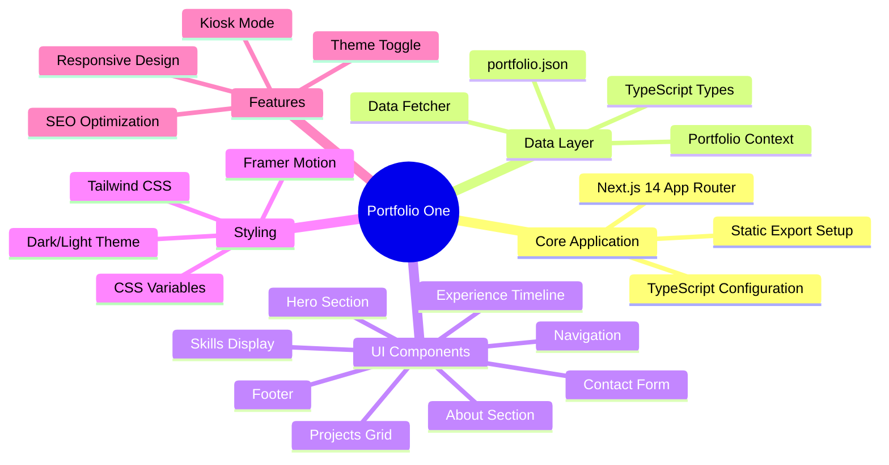
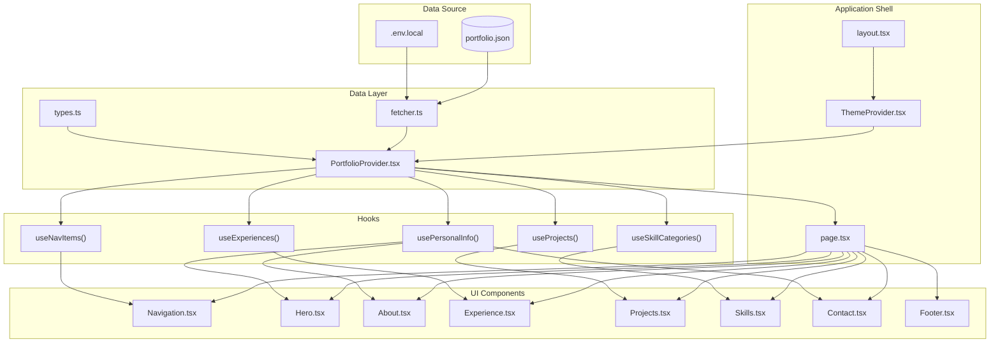
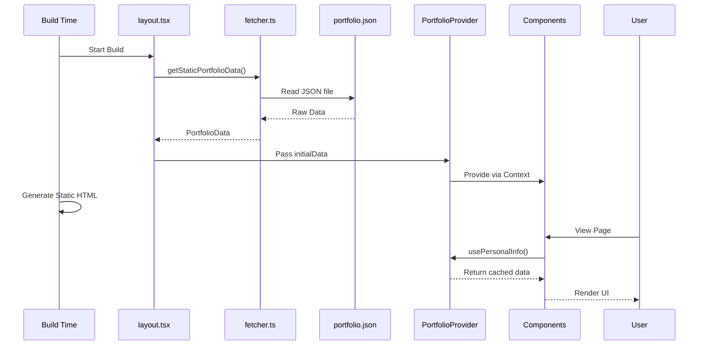
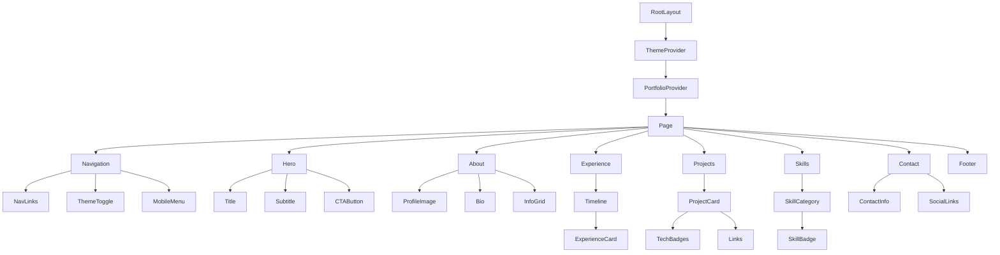
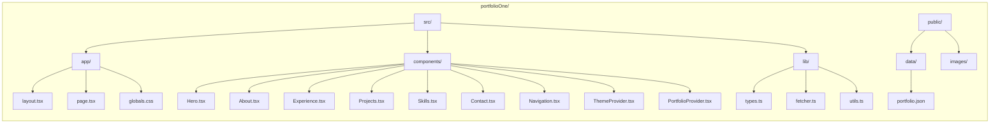
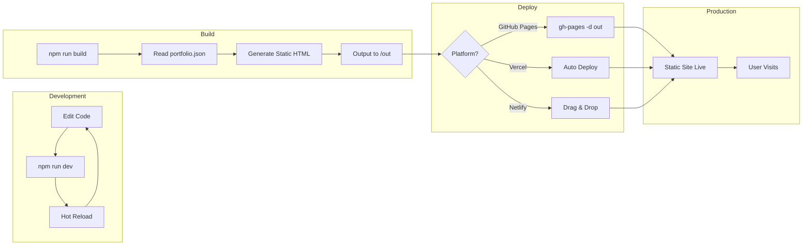
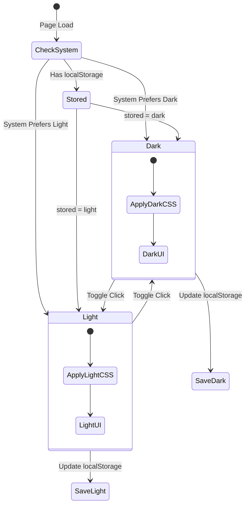

# Portfolio One - Visual Documentation

## Work Breakdown Structure (WBS)

## System Architecture

## Data Flow Diagram

## Component Hierarchy

## File Structure Tree

## Build & Deploy Process

## Theme System

